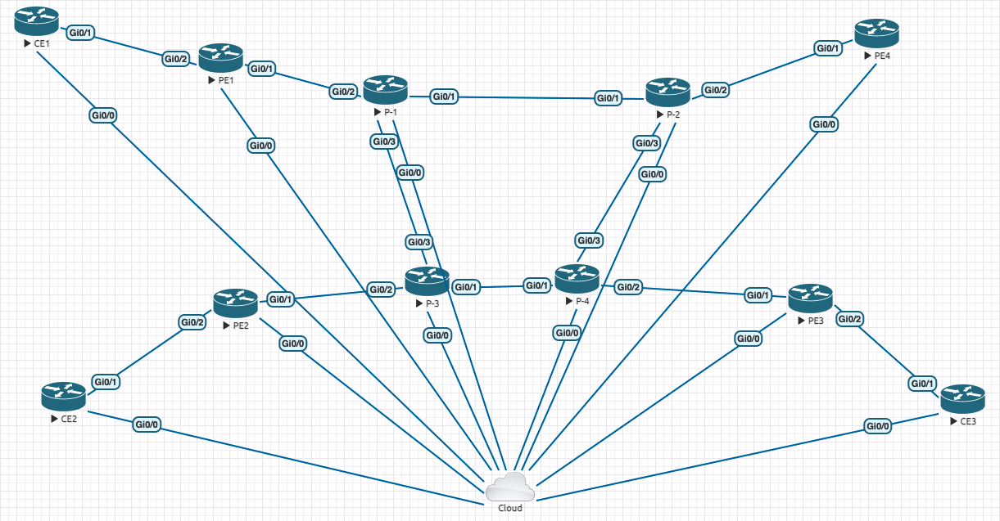

# MPLSL3VPN
MPLSL3VPN this setup invloves setting up MPLS L3 VPN using Ansible Playbooks
We have 2 Playbooks.
1. prouters.yml

   The P routers Ansible Playbook consists of multiple roles to allow us reuse roles across the entire topology.
   These roles are:
    - config_basic_interfaces
    - config_ospfv2
    - config_bgp
    - config_mpls

2. perouters.yml

   The PE routers Ansible Playbook consists of multiple roles to allow us reuse roles across
 the entire topology.
   These roles are:
    - config_basic_interfaces
    - config_ospfv2
    - config_bgp
    - config_mpls
    - vrf_management
## Diagram

